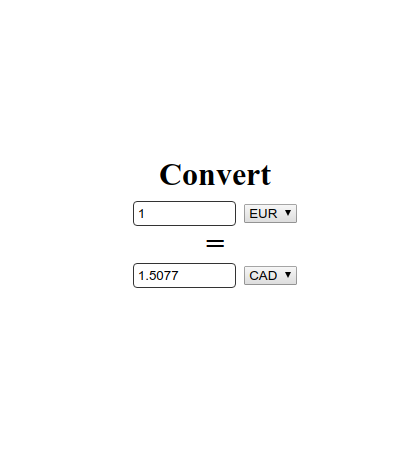

# Currency-Conversion
A currency converter app in React.js

## Preview


## Installation
To run the currency converter, run the following commands on your terminal
```
git clone https://github.com/kuruma99/Currency-Conversion.git
cd Currency-Conversion
npm install 
npm start
```

## Requirements
* Recent version of node.js installed
* npm 
* A web browser

## Features
- [x] Use of exchangerates.io API
- [x] Uses of React Hooks
- [x] No bootstrap used
- [x] Custom CSS
- [x] No use of Redux or ContextAPI
